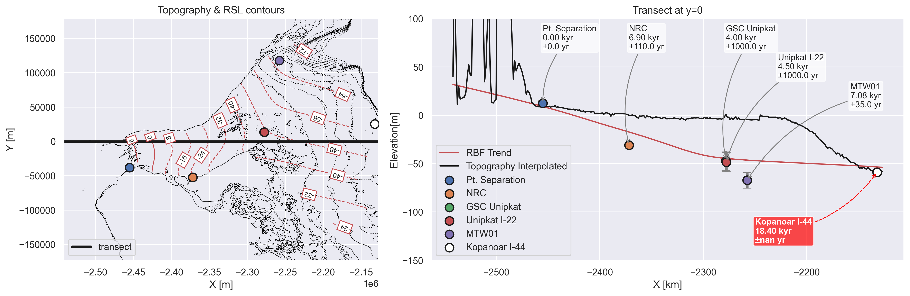

# Variation of bed interpolation

This repository is for debuging and collaboration
In order to run `core_elevations.ipynb` need to unzip netcdf_grids inside data folder (currently it is too heavy to be able to add on github, contact me to get the file)

I also commented out the cpu usaged inside the gstatsim_custom to run on mac without the need of installing CUDA

## Results

